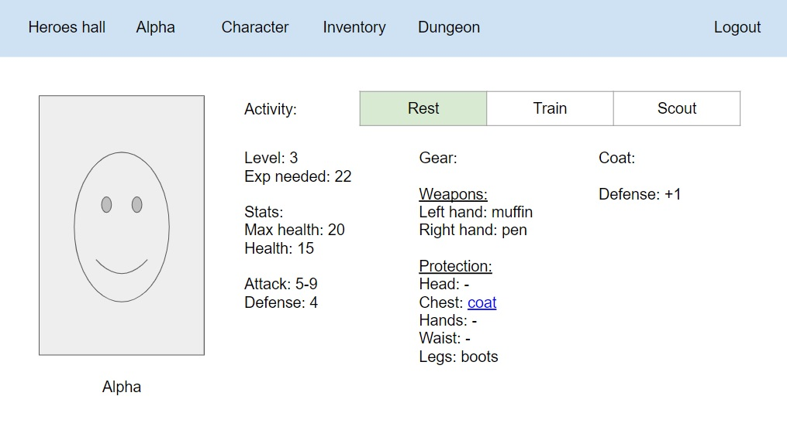

# Hero manager

## Description

The purpose of this team is to create a basic dungeon crawler hero manager. The user can have multiple heroes, each hero is managed separately. A hero has basic attributes like health, attack and defense. These attributes can be increased through leveling or with equipped items. A hero can aquire new items with clearing dungeons. Leveling is done by gaining more experience and experience is recieved for training and clearing obstacles in dungeons. If a hero dies than that hero remains dead.

## Technologies

In this project we are using Angular as frontend, and Node.js as backend combined with MySQL as database.
Apprentices create routing and layout included Angular components and services which use mock data at this point.
Apprentices create backend endpoints with Express which use a database layer to work with data.
Apprentices wire together frontend and backend and we can see real data in frontend received from backend.
Apprentices write tests for Angular components and services as well as backend endpoints.

### Angular
  - Angular CLI
  - Routing, Components, Services
  - Testing with Jasmine + Karma

### Node.js
  - Express
  - Mongoose
  - Testing with Mocha + Chai
  
### Database: MySQL

### CI/CD
  - CircleCI
  - Heroku or AWS

## Main Features

  - Multiple heros
  - Detailed character
  - Equipment system
  - Dungeon exploring

